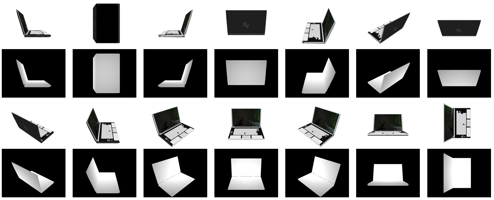

# ShapenetSem to RGBD

A script to render a 3D model from the ShapeNetSem dataset using Blender.
The render simulates a Kinect RGBD camera and outputs in the same data format.
The model is rendered from multiple viewpoints and optionally from canonical viewpoints.

Also, include some helper scripts to fix a bug with the ShapenetSem dataset and to parallelise the rendering of multiple objects simultaneously.

Tested on Windows 10, but should also work for other operating systems.
By default, the model is rendered from multiple viewpoints and canonical viewpoints.

The main script was written for Blender 2.9.0, with no further dependencies from external libraries.
(You can download Blender 2.9.0 at https://download.blender.org/release/Blender2.90/)

The helper scripts were written with Python 3.7.16 and with the use of the Pandas library (pip install pandas==1.0.2). However, it should work with no issues with more recent Python versions.

## ShapenetSem dataset

You can download the ShapenetSem dataset from https://huggingface.co/datasets/ShapeNet/ShapeNetSem-archive

The ShapenetSem dataset comes in the following structure:

    - models-binvox
    - models-binvox-solid
    - models-COLLADA
    - models-OBJ
    - models-textures
    - categories.synset.csv
    - densities.csv
    - materials.csv
    - metadata.csv
    - taxonomy.txt

The metadata.csv that comes with the download might be outdated. To download the most recent version of the metadata, go to https://dagshub.com/Rutam21/ShapeNetSem-Dataset_of_3D_Shapes
At the end of the page, you will find two links, one for downloading the current metadata and another with only models that have manually verified alignments and categorizations.

As of now, there is a bug when loading the ShapenetSem dataset to Blender, where the "Dissolve (d)" values in the .mtl files are inverted. This makes the models appear transparent.
To fix the issue, I made a helper script that inverts all the "d" values in the .mtl files.

To use it, run

    python fix_shapenetsem.py --directory /path/to/ShapeNetSem/models-OBJ/models/

This will correct the .mtl files. You can also optionally also save the corrected .mtl files to a different folder, without overwriting the originals, by using

    python fix_shapenetsem.py --directory /path/to/ShapeNetSem/models-OBJ/models/ --output_folder /path/to/output/

Finally, the .mtl files assume that the textures are in the same folder as the objects. So you can either:

    - Copy the textures files into the models folder (or vice-versa), or;

    - Create a new folder and copy the models and textures into it.

Either way, Blender will be able to load the files correctly.

## Render the models

To render a single `.obj` file, go to your Blender installation directory and run

    blender --background --python /path/to/render_blender.py -- --output_folder /path/to/outputs --up 0\,0\,1 --front 1\,0\,0 --aligned_dims 1.0\,1.0\,1.0 --unit 1.0 /path/to/my.obj

This will generate 8 renders of the object by rotating the camera in a birds-eye view, alongside 6 renders from the canonical orientations of up, down, left, right, front and back. The renders will contain an .png file with the RGB image and a corresponding .exr file with the depth.

The only required inputs are the output_folder and the path to the object. All options for the inputs can be optionally used. You can check all of them from inside the code, along with a help message explaining their usage.

The depth is computed to the camera plane, not the camera centre. The depth is expressed in meters.
The intrinsics of the camera are as follows:

    - Image width = 640
    - Image height = 480
    - ox = Image width / 2
    - oy = Image height / 2
    - Camera FOV = 57
    - fx = 588
    - fy = 588
    - Camera matrix = ((fx, 0, ox), (0, fy, oy), (0, 0, 1))

## Parallel rendering

To render a whole batch, I created a helper script that generates a list of commands, one for each of the models.
To use the script, run

    python generate_commands.py --metadata /path/to/ShapeNetSem/metadata.txt --obj_directory /path/to/ShapeNetSem/models-OBJ/models/ --render_blender_path /path/to/render_blender.py --output_directory /path/to/output/

This will only take into account models that contain a "unit" value in the metadata, which represents the scale of the object. Objects without scale were not considered because their depth would be dimensionless.

Then, I created another script that will read each one of the commands and execute them in parallel, having up to 5 instances of Blender running simultaneously.
You run it from inside your Blender installation directory using

    python /path/to/render_blender_parallel.py --file /path/to/commands.txt

## Example images

Here is an example computer model rendered with 8 different bird-eye views + 6 canonical views:

Code based on:
https://github.com/panmari/stanford-shapenet-renderer
https://github.com/JavonneM/BlenderToRGBD
